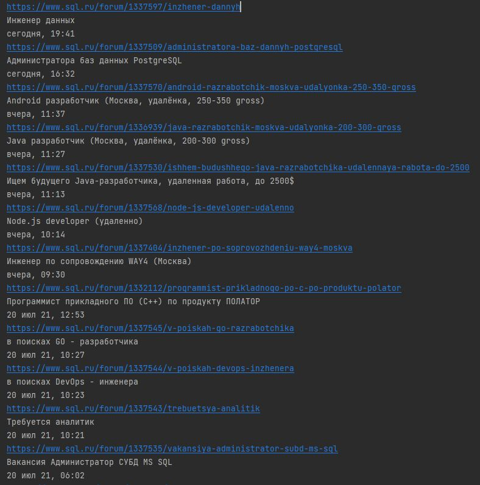

# Агрегатор вакансий
Приложение парсит вакансии с сайта sql.ru. Запускается по расписанию, считывает все вакансии, относящиеся к Java и записывает их в базу. 
Архитектура позволяет расширить его для парсинга вакансий с других сайтов.

## Технологии
- Java 15
- Postgresql
- JDBC
- Jsoup
- Quartz

